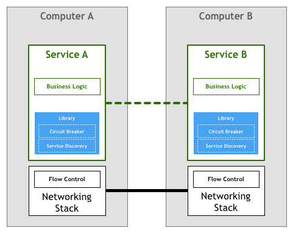
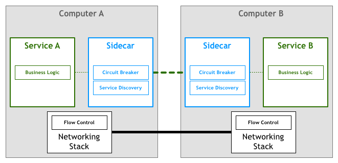
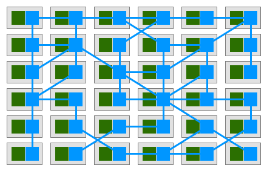
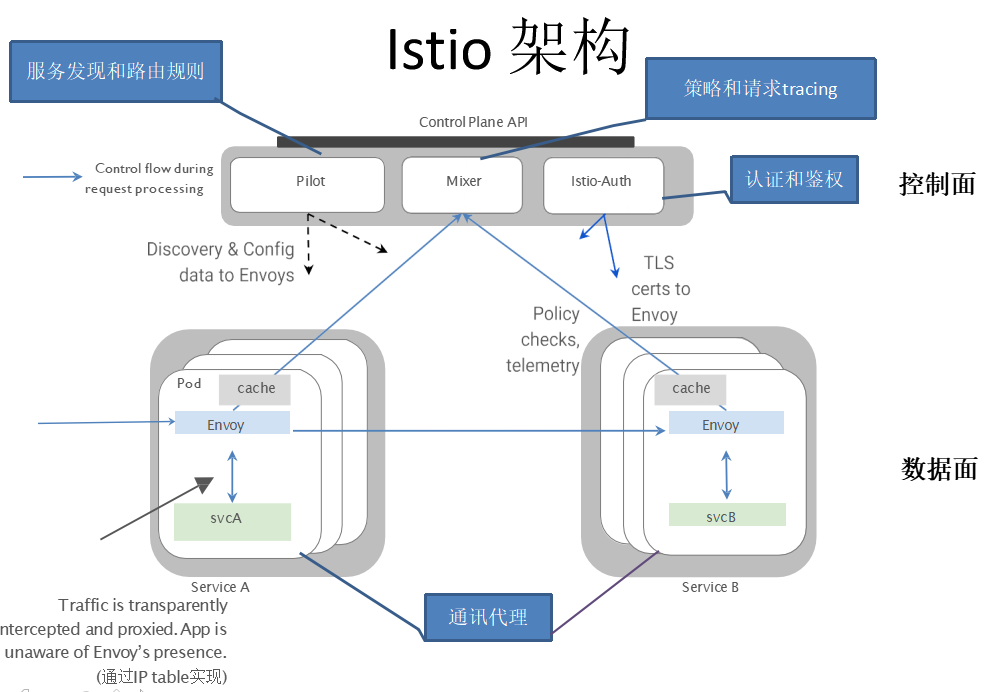
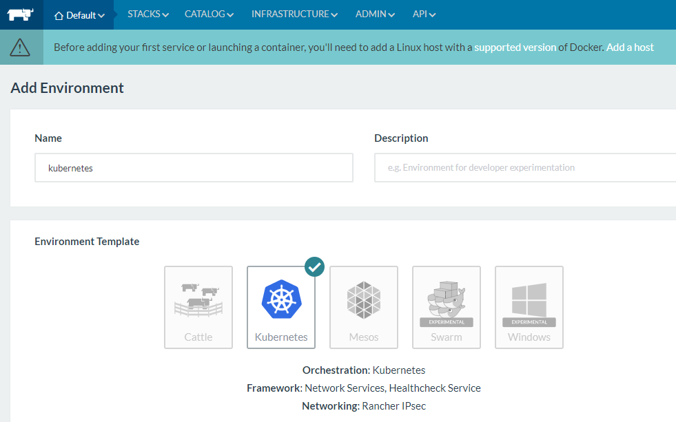
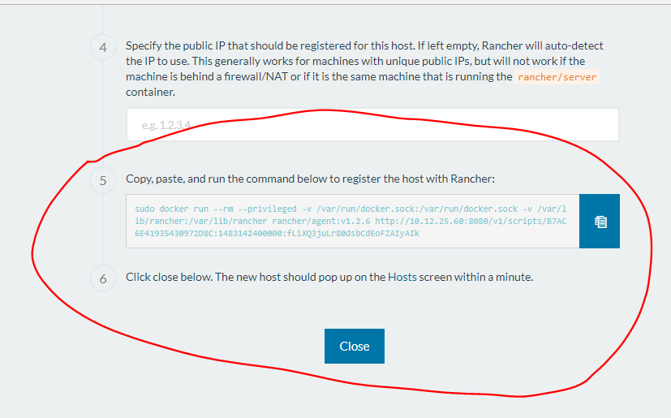
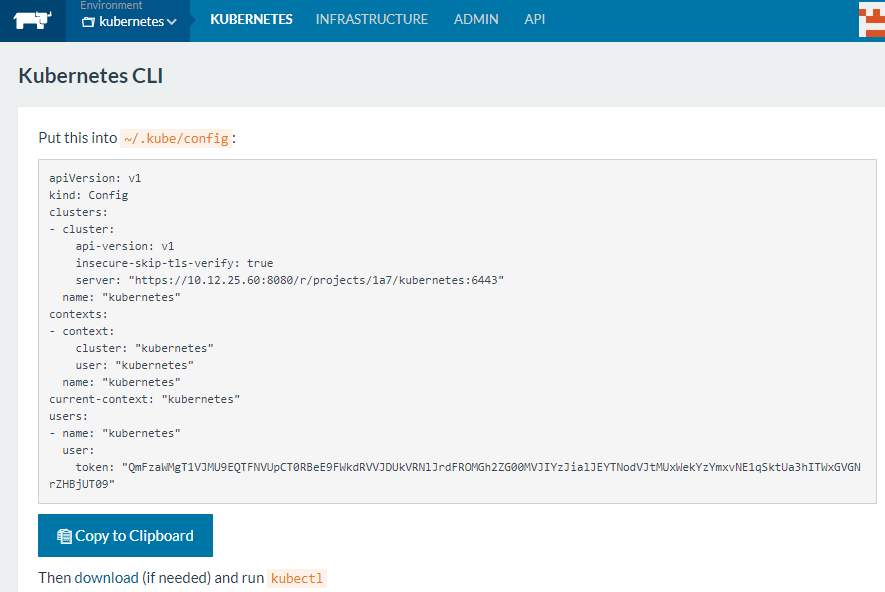
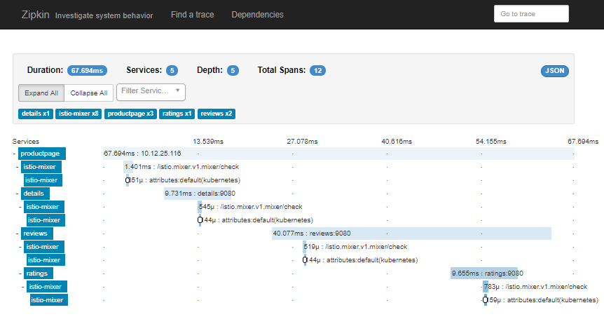
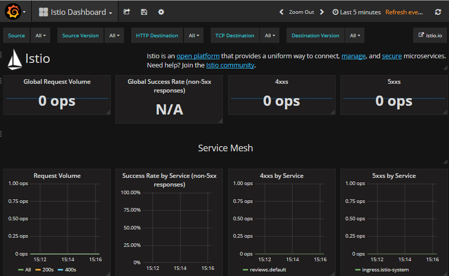

# 服务网格简介

**服务网格**（Service Mesh）是为解决微服务的通信和治理而出现的一种**架构模式**。

服务网格将服务间通讯以及与此相关的管理控制功能从业务程序中下移到一个基础设施层，从而彻底隔离了业务逻辑和服务通讯两个关注点。采用服务网格后，应用开发者只需要关注并实现应用业务逻辑。服务之间的通信，包括服务发现，通讯的可靠性，通讯的安全性，服务路由等由服务网格层进行处理，并对应用程序透明。

让我们来回顾一下微服务架构的发展过程。在出现服务网格之前，我们在微服务应用程序进程内处理服务通讯逻辑，包括服务发现，熔断，重试，超时等逻辑，如下图所示：  
  
通过对这部分负责服务通讯的逻辑进行抽象和归纳，可以形成一个代码库供应用程序调用。但应用程序还是需要处理和各种语言代码库的调用细节，并且各种代码库互不兼容，导致对应用程序使用的语言和代码框架有较大限制。

如果我们更进一步，将这部分逻辑从应用程序进程中抽取出来，作为一个单独的进程进行部署，并将其作为服务间的通信代理，如下图所示：  
  
因为通讯代理进程和应用进程一起部署，因此形象地把这种部署方式称为“sidecar”（三轮摩托的挎斗）。

应用间的所有流量都需要经过代理，由于代理以sidecar方式和应用部署在同一台主机上，应用和代理之间的通讯被认为是可靠的。然后由代理来负责找到目的服务并负责通讯的可靠性和安全等问题。

当服务大量部署时，随着服务部署的sidecar代理之间的连接形成了一个如下图所示的网格，被称之为Service Mesh（服务网格），从而得出如下的服务网格定义。

_服务网格是一个基础设施层，用于处理服务间通信。云原生应用有着复杂的服务拓扑，服务网格保证请求可以在这些拓扑中可靠地穿梭。在实际应用当中，服务网格通常是由一系列轻量级的网络代理组成的，它们与应用程序部署在一起，但应用程序不需要知道它们的存在。_

_William Morgan _[_WHAT’S A SERVICE MESH? AND WHY DO I NEED ONE?_](https://buoyant.io/2017/04/25/whats-a-service-mesh-and-why-do-i-need-one/)_                                               _



了解了服务网格的基本概念，下一步介绍一下[Istio](https://istio.io/)。Istio是来自Google，IBM和Lyft的一个Service Mesh（服务网格）开源项目，是Google继Kubernetes之后的又一大作，Istio架构先进，设计合理，刚一宣布就获得了Linkerd，nginmesh等其他Service Mesh项目的合作以及Red hat/Pivotal/Weaveworks/Tigera/Datawire等的积极响应。  
  
可以设想，在不久的将来，微服务的标准基础设施将是采用kubernetes进行服务部署和集群管理，采用Istio处理服务通讯和治理，两者相辅相成，缺一不可。

# 安装Kubernetes

Istio是微服务通讯和治理的基础设施层，本身并不负责服务的部署和集群管理，因此需要和Kubernetes等服务编排工具协同工作。

Istio架构非常开放，在设计上支持各种服务部署平台，包括kubernetes，cloud foundry，Mesos等，但Istio作为Google亲儿子，对自家兄弟Kubernetes的支持肯定是首先考虑的。目前版本的0.2版本的手册中也只有Kubernetes集成的安装说明，其它部署平台和Istio的集成将在后续版本中支持。  

从Istio控制面Pilot的架构图可以看到各种部署平台可以通过插件方式集成到Istio中，为Istio提供服务注册和发现功能。


kubernetes集群的部署较为复杂，[Rancher](http://rancher.com)提供了kubernetes部署模板，通过一键式安装，可以大大简化kubernetes集群的安装部署过程。

本文的测试环境为两台虚机组成的集群，操作系统是Ubuntu 16.04.3 LTS。两台虚机的地址分别为：
Rancher Server: 10.12.25.60
工作节点: 10.12.25.116

通过Rancher安装Kubernetes集群的简要步骤如下：

## 在server和工作节点上安装docker

因为k8s并不支持最新版本的docker，因此需根据该页面安装指定版本的docker  
[http://rancher.com/docs/rancher/v1.6/en/hosts/](http://rancher.com/docs/rancher/v1.6/en/hosts/) ,目前是1.12版本。

```
curl https://releases.rancher.com/install-docker/1.12.sh | sh
```

## 启动Rancher server

```
sudo docker run -d --restart=always -p 8080:8080 rancher/server
```

## 登录Rancher管理界面，创建k8s集群

Rancher 管理界面的缺省端口为8080，在浏览器中打开该界面，通过菜单Default-&gt;Manage Environment-&gt;Add Environment添加一个kubernetes集群。这里需要输入名称kubernetes，描述，然后选择kubernetes template，点击create，创建Kubernetes环境。

点击菜单切换到kubernetes Environment，然后点击右上方的Add a host，添加一台host到kubernetes集群中。注意添加到集群中的host上必须先安装好符合要求的docker版本。

然后根据Rancher页面上的提示在host上执行脚本启动Rancher agent，以将host加入ranch cluster。注意脚本中包含了rancher server的地址，在host上必须可以ping通该地址。

host加入cluster后Rancher会在host上pull kubernetes的images并启动kubernetes相关服务，根据安装环境所在网络情况不同需要等待几分钟到几十分钟不等。

## 安装并配置kubectl

待Rancher界面提示kubernetes创建成功后，安装kubernetes命令行工具kubectl

```
curl -LO https://storage.googleapis.com/kubernetes-release/release/v1.7.4/bin/linux/amd64/kubectl

chmod +x ./kubectl

sudo mv ./kubectl /usr/local/bin/kubectl
```

登录Rancher管理界面, 将 All Environments-&gt;kubernetes-&gt;KUBERNETES-&gt;CLI create config 的内容拷贝到~/.kube/config 中，以配置Kubectl和kubernetes server的连接信息。

# 安装Istio

Istio提供了安装脚本，该脚本会根据操作系统下载相应的Istio安装包并解压到当前目录。

```
 curl -L https://git.io/getLatestIstio | sh -
```

根据脚本的提示将Istio命令行所在路径加入到系统PATH环境变量中

```
export PATH="$PATH:/home/ubuntu/istio-0.2.10/bin"
```

在kubernetes集群中部署Istio控制面服务

```
kubectl apply -f istio-0.2.10/install/kubernetes/istio.yaml
```

确认Istio控制面服务已成功部署。Kubernetes会创建一个istio-system namespace，将Istio相关服务部署在该namespace中。

确认Istio相关Service的部署状态

```
kubectl get svc -n istio-system
```

```
NAME            CLUSTER-IP      EXTERNAL-IP        PORT(S)                                                  AGE
istio-egress    10.43.192.74    <none>             80/TCP                                                   25s
istio-ingress   10.43.16.24     10.12.25.116,...   80:30984/TCP,443:30254/TCP                               25s
istio-mixer     10.43.215.250   <none>             9091/TCP,9093/TCP,9094/TCP,9102/TCP,9125/UDP,42422/TCP   26s
istio-pilot     10.43.211.140   <none>             8080/TCP,443/TCP                                         25s
```

确认Istio相关Pod的部署状态

```
kubectl get pods -n istio-system
```

```
NAME                             READY     STATUS    RESTARTS   AGE
istio-ca-367485603-qvbfl         1/1       Running   0          2m
istio-egress-3571786535-gwbgk    1/1       Running   0          2m
istio-ingress-2270755287-phwvq   1/1       Running   0          2m
istio-mixer-1505455116-9hmcw     2/2       Running   0          2m
istio-pilot-2278433625-68l34     1/1       Running   0          2m
```

从上面的输出可以看到，这里部署的主要是Istio控制面的服务，而数据面的网络代理要如何部署呢？
根据前面服务网格的架构介绍可以得知，网络代理是随着应用程序以sidecar的方式部署的，在下面部署Bookinfo示例程序时会演示如何部署网络代理。

# 部署Bookinfo示例程序

在下载的Istio安装包的samples目录中包含了示例应用程序。

通过下面的命令部署Bookinfo应用

```
kubectl apply -f <(istioctl kube-inject -f istio-0.2.10/samples/bookinfo/kube/bookinfo.yaml)
```

我们知道kubectl apply命令在这里是用于部署kubernetes服务的，但在这里该命令行的参数不是一个kubernetes yaml文件，而是`istioctl kube-inject -f istio-0.2.10/samples/bookinfo/kube/bookinfo.yaml`命令的输出。  
该命令在这里起到了什么作用呢？通过单独运行该命令并将输出保存到文件中，我们可以查看istioctl kube-inject命令在这里的用途。

```
istioctl kube-inject -f istio-0.2.10/samples/bookinfo/kube/bookinfo.yaml >> bookinfo_with_sidecar.yaml
```

打开bookinfo\_with\_sidecar.yaml文件，可以看到该命令为每一个服务都注入一个istio-proxy代理。  
Istio的kube-inject工具的用途即是将代理sidecar注入了Bookinfo的kubernetes yaml部署文件中，通过该方式，不需要用户手动修改kubernetes的部署文件，即可在部署服务时将sidecar一起部署，实现了Istio代理部署对应用部署透明性。

```
      image: docker.io/istio/proxy_debug:0.2.10
        imagePullPolicy: IfNotPresent
        name: istio-proxy
        resources: {}
        securityContext:
          privileged: true
          readOnlyRootFilesystem: false
          runAsUser: 1337
        volumeMounts:
        - mountPath: /etc/istio/proxy
          name: istio-envoy
        - mountPath: /etc/certs/
          name: istio-certs
          readOnly: true
```

确认Bookinfo服务已经启动

```
kubectl get services
```

```
NAME          CLUSTER-IP      EXTERNAL-IP   PORT(S)    AGE
details       10.43.175.204   <none>        9080/TCP   6m
kubernetes    10.43.0.1       <none>        443/TCP    5d
productpage   10.43.19.154    <none>        9080/TCP   6m
ratings       10.43.50.160    <none>        9080/TCP   6m
reviews       10.43.219.248   <none>        9080/TCP   6m
```

在浏览器中打开应用程序页面，地址为istio-ingress的External IP

`http://10.12.25.116/productpage`  


# 测试路由规则

多次刷新Bookinfo应用的productpage页面，我们会发现该页面中显示的Book Reviews有时候有带红星的评价信息，有时有带黑星的评价信息，有时只有文字评价信息。  
这是因为Bookinfo应用程序部署了3个版本的Reviews服务，每个版本的返回结果不同，在没有设置路由规则时，缺省的路由会将请求随机路由到每个版本的服务上，如下图所示：


通过创建一条路由规则route-rule.yaml，将请求流量都引导到Reviews-v1服务上

```
apiVersion: config.istio.io/v1alpha2
kind: RouteRule
metadata:
  name: reviews-default
spec:
  destination:
    name: reviews
  precedence: 1
  route:
  - labels:
      version: v1
```

启用该路由规则

```
istioctl create -f route_rule.yaml -n default
```

再次打开productpage页面, 无论刷新多少次，显示的页面将始终是v1版本的输出，即不带星的评价内容。  
  
删除该路由规则

```
istioctl delete -f route_rule.yaml -n default
```

继续刷新productpage页面,将重新随机出现三个版本的评价内容页面。
# 分布式调用追踪
首先修改安装包中的 `istio-0.2.10/install/kubernetes/addons/zipkin.yaml` 部署文件，增加Nodeport,以便能在kubernetes集群外部访问zipkin界面。


```
apiVersion: v1
kind: Service
metadata:
  name: zipkin
  namespace: istio-system
spec:
  ports:
  - name: http
    port: 9411
    nodePort: 30001
  selector:
    app: zipkin
  type: NodePort
```

部署zipkin服务。
```
kubectl apply -f istio-0.2.10/install/kubernetes/addons/zipkin.yaml
```
在浏览器中打开zipkin页面，可以追踪一个端到端调用经过了哪些服务，以及各个服务花费的时间等详细信息，如下图所示：
`http://10.12.25.116:30001`  

# 性能指标监控

首先修改安装包中的 `istio-0.2.10/install/kubernetes/addons/grafana.yaml` 部署文件，增加Nodeport,以便能在kubernetes集群外部访问grafana界面。


```
apiVersion: v1
kind: Service
metadata:
  name: grafana
  namespace: istio-system
spec:
  ports:
  - port: 3000
    protocol: TCP
    name: http
    nodePort: 30002
  selector:
    app: grafana
  type: NodePort
```

prometheus用于收集和存储信息指标，grafana用于将性能指标信息进行可视化呈现，需要同时部署prometheus和grafana服务。
```
kubectl apply -f istio-0.2.10/install/kubernetes/addons/prometheus.yaml

kubectl apply -f istio-0.2.10/install/kubernetes/addons/grafana.yaml
```
首先在浏览器中打开Bookinfo的页面`http://10.12.25.116/productpage`，刷新几次，以制造一些性能指标数据。

然后打开grafana页面查看性能指标`http://10.12.25.116:30002/dashboard/db/istio-dashboard`，如下图所示：


# 参考

- [Istio官方文档](https://istio.io/docs/)
- [Pattern: Service Mesh](http://philcalcado.com/2017/08/03/pattern_service_mesh.html)
- [WHAT’S A SERVICE MESH? AND WHY DO I NEED ONE?](https://buoyant.io/2017/04/25/whats-a-service-mesh-and-why-do-i-need-one/)


